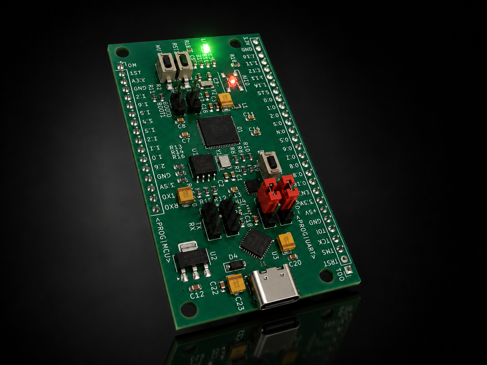
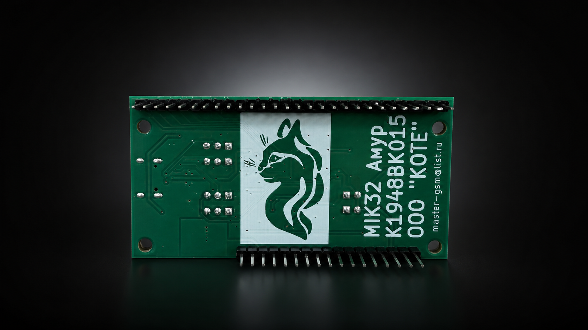
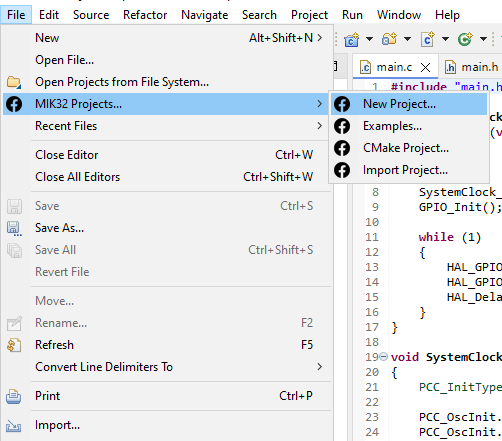
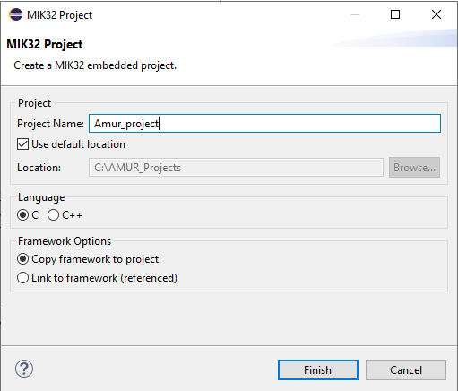
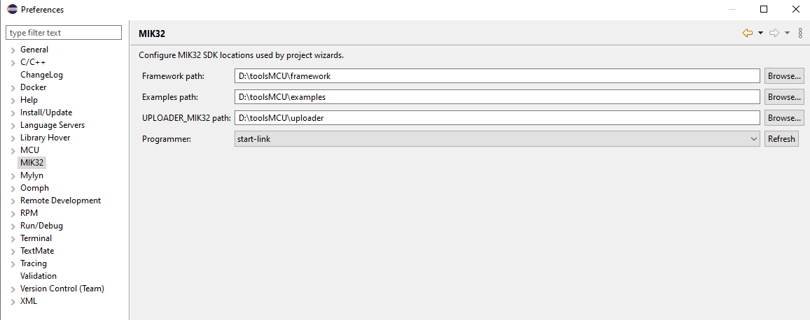

# 🚀 MIK32 Eclipse Tools
**Профессиональная среда разработки для микроконтроллеров МИК32 «Амур» (RISC-V)**

---

  
  

**MIK32 Eclipse Tools** - это лучшее расширение для Eclipse IDE, превращающее стандартную среду разработки в мощный и интуитивно понятный инструмент для работы с первым серийным 32-битным микроконтроллером на архитектуре RISC-V российского производства - **МИК32 «Амур»**.

Плагин берет на себя всю сложную рутину по настройке окружения, созданию файлов компоновщика (linker scripts) и конфигурации отладчика, позволяя разработчику сразу приступить к написанию полезного кода.

## 🌟 Почему именно это расширение?

* **Минимум ручной конфигурации:** Плагин берет на себя настройку библиотек, скриптов компоновщика (линкеров) и интеграцию с программатором. *Примечание: пути для сборки (Toolchain) настраиваются пользователем самостоятельно.* В настройках плагина достаточно указать пути до фреймворка, примеров и загрузчика.
* **Свой раздел в меню Eclipse:** В IDE добавляется меню **«MIK32 Projects»** для быстрого создания проекта или использования шаблона. Шаблоны сразу автоматически настраивают библиотеку, скрипты компоновщика и программатор. При указании пути к загрузчику можно сразу выбрать нужный интерфейс отладчика из доступных (на базе скриптов `uploader/openocd-scripts/interface`).
* **Поддержка разных типов памяти:** Из коробки доступны и автоматически настраиваются профили сборки для **EEPROM**, **Flash** и **RAM** - переключайтесь между ними в один клик.

## ⚙️ Основной функционал плагина

1. **Мастер создания проектов (New Project Wizard):** Пошаговый графический интерфейс для генерации базового C/C++ проекта (содержит startup-код, HAL и необходимые скрипты).
2. **Интеграция CMake:** Отдельный мастер для создания проектов на базе современного сборочного конвейера CMake для более сложных архитектур ПО.
3. **Библиотека примеров (Examples):** Удобный обозреватель готовых проектов и примеров для изучения работы с периферией (UART, SPI, I2C, таймеры и др.).
4. **Умный импорт (Import Project):** Инструментарий для корректного импорта существующих проектов MIK32 в ваше рабочее пространство Eclipse.
5. **Страница настроек (Preferences):** Глобальная конфигурация путей к фреймворку MIK32, библиотеке примеров и скриптам загрузчика (программатора).

## 📸 Интерфейс и работа с плагином

Интерфейс плагина аккуратно и бесшовно интегрирован в визуальный стиль Eclipse. 

<table align="center">
  <tr>
    <td align="center"><b>Мастер создания проекта</b></td>
    <td align="center"><b>Настройка проекта</b></td>
    <td align="center"><b>Конфигурация памяти</b></td>
  </tr>
  <tr>
    <td align="center"></td>
    <td align="center"></td>
    <td align="center"></td>
  </tr>
</table>

## 🛠 Требования к системе

* **Eclipse IDE** for Embedded C/C++ Developers (для разработки встраиваемых систем).
* Установленный **RISC-V GCC Toolchain** (например, xPack GNU RISC-V Embedded GCC).
* **OpenOCD** (с поддержкой JTAG для микроконтроллеров МИК32).
* JRE 17 или выше.

## 🚀 Установка

**Способ 1: Установка по ссылке (Рекомендуется)**
1. Запустите Eclipse и откройте меню `Help` ➔ `Install New Software...`
2. Нажмите кнопку `Add...`.
3. В поле *Location* вставьте ссылку: `https://timmarsov.github.io/MIK32EclipseTools/`
4. Выделите появившийся компонент **MIK32 Tools**, нажмите `Next` и следуйте шагам мастера.
5. Перезапустите Eclipse.

**Способ 2: Установка из архива**
1. Перейдите в раздел [Releases](../../releases) и скачайте актуальный архив плагина.
2. В окне `Install New Software...` ➔ `Add...` нажмите `Archive...` и выберите скачанный `.zip` архив.
3. Установите и перезапустите IDE.

## 💻 Быстрый старт

1. Первым делом перейдите в настройки Eclipse (`Window` ➔ `Preferences` ➔ `MIK32`) и укажите правильные пути к фреймворку, библиотеке примеров и загрузчику. *(Убедитесь также, что у вас прописаны глобальные пути к вашему RISC-V Toolchain в стандартных настройках C/C++ Eclipse).*
2. Откройте меню **`File` ➔ `MIK32 Projects...` ➔ `New Project...`**
3. Введите название проекта.
4. Выберите нужную конфигурацию памяти (RAM, Flash или EEPROM).
5. Проект сгенерируется со всей необходимой структурой, файлами startup и linker scripts.
6. Нажмите **`Build`** (Иконка молотка в панели инструментов) — ваш бинарный файл готов к прошивке в микроконтроллер!

## 🎛 Отладочная плата

На изображениях в начале страницы представлена бюджетная отладочная плата для микроконтроллера МИК32 «Амур», произведенная **ООО «КоТе»**. 

Плата идеально подходит для быстрого старта разработки и прототипирования. Основные преимущества:
* Встроенный программатор
* Адресный и обычный светодиод на борту
* Flash-память

Для заказа платы и уточнения любых деталей по отладке обращайтесь по электронной почте: **[master-gsm@list.ru](mailto:master-gsm@list.ru)**

## 📄 Лицензия

Плагин распространяется под открытой лицензией. Подробная информация доступна в файле [LICENSE](LICENSE).

---

<i>Отечественная микроэлектроника стала ближе и удобнее для разработчика.</i>

